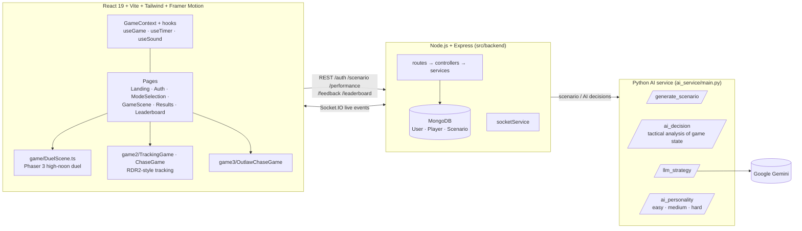

# 🔫 Bounty Hunter's Training Ground

A lavish, feature-rich, responsive web application for training bounty hunters in AI-driven duels, chases, and tracking exercises. Built with modern web technologies and cinematic Wild West aesthetics.


## 🎯 Features

### 🎮 Core Gameplay
- **High Noon Duels**: Lightning-fast shootouts with AI opponents
- **Real-time Performance Tracking**: Reaction time, accuracy, and strategy ratings
- **AI-Generated Scenarios**: Dynamic scenario descriptions for immersive gameplay
- **Progressive Difficulty**: Multiple skill levels and opponent types

### 🎨 Visual Design
- **Cinematic Wild West Aesthetic**: Rich textures, animated transitions, and immersive design
- **Custom Color Palette**: Wild West, Desert, and Saloon themed colors
- **Animated UI Components**: Smooth page transitions using Framer Motion
- **Responsive Design**: Works on desktop, tablet, and mobile devices

### 🔊 Audio & Immersion
- **Sound System**: Gunfire, reload, hit/miss, and environmental sounds
- **Ambient Audio**: Dynamic background sounds based on scenarios
- **Volume Controls**: Master, SFX, music, and ambient volume settings

### 📊 Performance Analytics
- **Score Breakdown**: Detailed performance analysis with grades (S, A, B, C, D, F)
- **Statistics Tracking**: Win/loss ratios, average accuracy, reaction times
- **Achievement System**: Unlockable achievements for various milestones
- **Leaderboard**: Local high scores with persistent storage

## 🛠 Tech Stack

### Frontend Framework
- **React 19+** with functional components and hooks
- **TypeScript** for type safety and better development experience
- **Vite** for fast development and building

### Styling & Animation
- **Tailwind CSS** with custom Wild West theme configuration
- **Framer Motion** for smooth animations and page transitions
- **Custom CSS** for specialized Western-themed effects

### Game Engine
- **Phaser.js** for 2D game rendering and physics
- **HTML5 Canvas** for high-performance graphics
- **Custom game scenes** for different training modes

### State Management
- **React Context API** for global game state
- **Custom hooks** for game logic, sound, and utilities
- **Local Storage** for persistent data (scores, settings, achievements)

## 🏗 Architecture

TrainRDR is made of three services: a React and Phaser client, a Node/Express game API, and a Python AI service that drives opponent behaviour.



| Layer | Responsibility |
|---|---|
| **Client** | Game modes, HUD, scoring overlay, leaderboards and auth. Phaser renders the duel scene, and React handles UI and state. |
| **Game API** | Auth, AI-generated scenarios, saving performance results (reaction time, accuracy), feedback and leaderboards. Socket.IO provides real-time updates. |
| **AI service** | Opponent decision-making from the current game state, difficulty-based personalities, and LLM-generated strategy and scenario text. |

## 🚀 Getting Started

### Prerequisites
- Node.js 18+ and npm
- Modern web browser with ES6+ support

### Installation
```bash
# Install dependencies
npm install

# Start development server
npm run dev

# Build for production
npm run build
```

### Backend services

```bash
# Game API (Express + MongoDB + Socket.IO) — configure src/backend/.env from .env.example
cd src/backend
npm install
npm run dev            # nodemon app.js (API on :3001 per frontend config)

# AI service (FastAPI) — needs GEMINI_API_KEY in ai_service/.env
cd ai_service
pip install -r requirements.txt
python main.py         # http://localhost:5001
```

## 🎮 How to Play

### Duel Mode Instructions
1. **Choose Training Mode**: Select "High Noon Duel" from the mode selection
2. **Read Scenario**: Review the AI opponent and environment details
3. **Prepare for Draw**: Wait for the countdown (3... 2... 1...)
4. **DRAW!**: Click/tap when "DRAW!" appears - speed is crucial
5. **Aim and Fire**: Click on your opponent to shoot
6. **Review Results**: Analyze your performance and aim for improvement

### Controls
- **Mouse/Touch**: Click/tap to shoot
- **Spacebar**: Alternative shoot button
- **ESC**: Pause/resume game
- **Enter**: Confirm selections in menus

## 📈 Scoring System

### Performance Metrics
- **Reaction Time**: How quickly you respond to "DRAW!" (measured in milliseconds)
- **Accuracy**: How precisely you hit your target (percentage)
- **Strategy Rating**: Overall tactical execution (0-100%)
- **Final Score**: Calculated composite score (0-100 points)

### Grade Scale
- **S (90-100)**: Legendary performance
- **A (80-89)**: Excellent skills
- **B (70-79)**: Good fundamentals
- **C (60-69)**: Fair ability
- **D (50-59)**: Needs improvement
- **F (0-49)**: More training required

## 🎨 Project Structure

```
src/
├── components/          # Reusable UI components
│   ├── ui/             # Basic UI components (Button, Card, Modal, Tooltip)
│   └── game/           # Game-specific components (HUD, GameCanvas)
├── pages/              # Main application pages
├── hooks/              # Custom React hooks
├── context/            # React Context providers
├── types/              # TypeScript type definitions
├── utils/              # Utility functions
└── assets/             # Game assets (placeholder)
```

## 🎯 Game Modes

### 1. High Noon Duel (Available)
- **Objective**: Quick-draw shootouts against AI opponents
- **Skills Tested**: Reaction time, accuracy, nerve under pressure
- **Scenarios**: Town square, canyon, saloon showdowns

### 2. Outlaw Chase (Coming Soon)
- **Objective**: Pursue criminals across the frontier
- **Skills Tested**: Strategy, persistence, tactical thinking

### 3. Bounty Tracking (Coming Soon)
- **Objective**: Hunt down elusive targets using stealth
- **Skills Tested**: Patience, observation, deduction

## 🏆 Achievement System

### Available Achievements
- **First Win**: Complete your first successful duel
- **Perfect Accuracy**: Achieve 100% accuracy in a round
- **Fast Draw**: React in under 200ms
- **Win Streak**: Win 5 consecutive duels
- **Veteran**: Complete 100 training sessions

## 📱 Responsive Design

The application is fully responsive and optimized for:
- **Desktop**: Full-featured experience with mouse controls
- **Tablet**: Touch-optimized interface with gesture support
- **Mobile**: Streamlined UI with thumb-friendly controls

## 🤝 Contributing

### Development Guidelines
1. Follow TypeScript best practices
2. Use provided ESLint and Prettier configurations
3. Write meaningful commit messages
4. Test thoroughly before submitting PRs
5. Update documentation for new features

## 📋 TODO / Roadmap

### High Priority
- [ ] Complete Chase mode implementation
- [ ] Add Tracking mode gameplay
- [ ] Implement multiplayer duels
- [ ] Add more AI opponents with unique behaviors
- [ ] Create tutorial/training mode for new players

### Medium Priority
- [ ] Add more environmental scenarios
- [ ] Implement weapon customization
- [ ] Add daily challenges and events
- [ ] Create achievement showcase page
- [ ] Add social sharing features

## 🐛 Known Issues

- Sound files are currently placeholders (need actual audio assets)
- Some animations may be performance-intensive on older devices
- Game canvas requires modern browser support
- Touch controls could be improved for mobile devices

## 📄 License

This project is licensed under the MIT License.

---

**Happy Hunting, Partner! 🤠**

*May your draw be swift and your aim be true in the Bounty Hunter's Training Ground.*

You can also install [eslint-plugin-react-x](https://github.com/Rel1cx/eslint-react/tree/main/packages/plugins/eslint-plugin-react-x) and [eslint-plugin-react-dom](https://github.com/Rel1cx/eslint-react/tree/main/packages/plugins/eslint-plugin-react-dom) for React-specific lint rules:

```js
// eslint.config.js
import reactX from 'eslint-plugin-react-x'
import reactDom from 'eslint-plugin-react-dom'

export default tseslint.config([
  globalIgnores(['dist']),
  {
    files: ['**/*.{ts,tsx}'],
    extends: [
      // Other configs...
      // Enable lint rules for React
      reactX.configs['recommended-typescript'],
      // Enable lint rules for React DOM
      reactDom.configs.recommended,
    ],
    languageOptions: {
      parserOptions: {
        project: ['./tsconfig.node.json', './tsconfig.app.json'],
        tsconfigRootDir: import.meta.dirname,
      },
      // other options...
    },
  },
])
```
